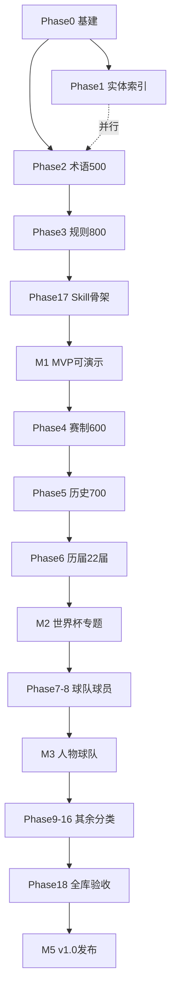

# 世界杯常识知识库 — 长期任务计划

> 目标：10,000 条常识 + World Cup Skill  
> 任务主表：[`data/tasks.csv`](../data/tasks.csv)（**235 项**，可逐条更新 `status` / `actual_rows`）

---

## 一、总览

| 指标 | 数值 |
|------|------|
| 知识条目目标 | **10,000** |
| 知识条目实计 | **10,910**（含补遗批次 T232/T256） |
| 任务总数 | **235** |
| 数据采集批次 | **202**（每批 50–90 条，含约 12% 冗余缓冲） |
| 实体条目 | **449** |
| 预估总工时 | **~860 小时**（按 tasks.csv 汇总） |
| 建议周期 | **4–6 个月**（兼职节奏）或 **6–8 周**（全职冲刺） |
| 发布版本 | **v1.0.1**（2026-06-05） |

### 进度状态枚举

| status | 含义 |
|--------|------|
| `not_started` | 未开始 |
| `in_progress` | 进行中 |
| `review` | 待抽检/Review |
| `done` | 已完成 |
| `blocked` | 阻塞（在 notes 写原因） |

---

## 二、八个阶段（Phase 0–18）

```
Phase 0  项目基建          ██████████  9/9   done
Phase 1  实体与索引        ██████████  9/9   done  (449 实体)
Phase 2  术语百科          ██████████  11/11 done  (500 条)
Phase 3  规则与裁判        ██████████  17/17 done  (800 条)
Phase 4  赛制与组织        ██████████  11/11 done  (500 条)
Phase 5  世界杯历史        ██████████  11/11 done  (700 条)
Phase 6  历届世界杯        ██████████  24/24 done  (2060 条)
Phase 7  国家队            ██████████  21/21 done  (1200 条)
Phase 8  球员与教练        ██████████  31/31 done  (1500 条)
Phase 9  俱乐部与联赛      ██████████  14/14 done  (650 条)
Phase 10 战术与位置        ██████████  13/13 done  (600 条，含 T232 补遗)
Phase 11 纪录与统计        ██████████  17/17 done  (800 条，含 T256 补遗)
Phase 12 裁判与纪律        ██████████  7/7   done  (300 条)
Phase 13 场地装备科技      ██████████  9/9   done  (400 条)
Phase 14 女子世界杯        ██████████  9/9   done  (400 条)
Phase 15 文化观赛          ██████████  7/7   done  (300 条)
Phase 16 健康训练          ██████████  5/5   done  (200 条)
Phase 17 Skill集成         ██████████  5/5   done
Phase 18 全库验收          ██████████  5/5   done  (T500–T504)
```

**任务完成率：235 / 235（100%）**

---

## 三、里程碑（Milestone）

| 里程碑 | 完成条件 | 对应任务 | 实计条目 | 状态 |
|--------|----------|----------|:--------:|:----:|
| **M0** 方案冻结 | Schema + 任务表 + 拒答策略 | T000–T003 | 0 | ✅ |
| **M1** 可演示 MVP | 术语500 + 规则800 + Skill骨架 | T030 + T056 + T400 | 1,300+ | ✅ |
| **M2** 世界杯专题 | 赛制600 + 历史700 + 历届2000 | T070 + T090 + T123 | 4,000+ | ✅ |
| **M3** 人物球队齐全 | 国家队1200 + 球员1500 | T150 + T190 | 6,700+ | ✅ |
| **M4** 全分类覆盖 | 剩余6个分类全部完成 | T304 | 10,000+ | ✅ |
| **M5** v1.0 发布 | 全库验收 + Skill测试通过 | T504 | **10,910** | ✅ |

---

## 四、推荐执行顺序（关键路径）



**原则：**
1. **先高频、后长尾** — 规则/术语/赛制优先于健康训练/文化
2. **每批 50 条** — 写完即校验，不堆大文件
3. **M1 即上线 Skill 骨架** — 1300 条已能回答大部分新手问题
4. **历届世界杯按届并行** — T100–T122 可分给不同 session 独立做

---

## 五、单次工作单元（Sprint）建议

| Sprint | 时长 | 目标 | 产出 |
|--------|------|------|------|
| Sprint 1 | 1 周 | 基建 + 术语 | T005–T029，500 条 |
| Sprint 2 | 1 周 | 规则全集 | T040–T055，800 条 |
| Sprint 3 | 1 周 | Skill MVP | T400–T404 + M1 |
| Sprint 4 | 2 周 | 赛制 + 历史 | 1300 条 |
| Sprint 5 | 3 周 | 历届世界杯 22 届 | 2000 条 |
| Sprint 6 | 2 周 | 国家队 | 1200 条 |
| Sprint 7 | 3 周 | 球员教练 | 1500 条 |
| Sprint 8 | 2 周 | 剩余分类 | 2700 条 |
| Sprint 9 | 1 周 | 全库验收 | v1.0.1 |

---

## 六、每批数据采集 SOP（标准流程）

每条任务（如 `T041 规则批次02:越位规则`）执行时：

1. **读任务行** — 确认 `target_rows`、`output_file`、`acceptance_criteria`
2. **列出来源** — FIFA / IFAB / 官方纪录，写入 `source_ref`
3. **按模板填 CSV** — 50 条，ID 连续（如 `WC-RULE-00051` ~ `00100`）
4. **自检清单**
   - [ ] 必填 26 列无空
   - [ ] 无赌博/赔率/盘口关键词
   - [ ] `answer_short` ≤ 120 字
   - [ ] `keywords` ≥ 3 个
5. **跑校验脚本** — `python scripts/validate_knowledge.py data/knowledge_rules.csv`
6. **更新 tasks.csv** — `status=review` → 抽检通过后 `done`，填 `actual_rows`

---

## 七、质量门禁

| 门禁 | 触发任务 | 标准 |
|------|----------|------|
| 批次门禁 | 每个 `review` 任务 | 校验脚本零 error |
| 分类门禁 | T030/T056/T070… | 该分类全量 + 5% 人工抽检 |
| 赌博门禁 | T501 | 全库扫描零命中 |
| 发布门禁 | T503 | 随机 500 条准确率 ≥ 95% |

---

## 八、并行策略

以下任务**无强依赖**，可同时进行：

| 并行组 | 任务范围 |
|--------|----------|
| A 组 | Phase 1 实体索引（T010–T017） |
| B 组 | Phase 2 术语（T020–T029） |
| C 组 | Phase 6 历届世界杯（T100–T122，每届独立） |
| D 组 | Phase 7 国家队（T130–T149，每队独立） |

**不可并行：** Phase 3 规则需在 Phase 2 术语抽检后（概念一致）；Skill 集成 T400 建议在术语+规则有 300 条后启动。

---

## 九、风险与应对

| 风险 | 应对 |
|------|------|
| 数据量大导致重复 | 每批写入前 grep `question` 去重；T502 全库 ID 检查 |
| 规则时效变化（2026 扩军） | `content_flags=time_sensitive`，定期复查 T052/T063/T122 |
| 赌博类误采集 | 批次自检 + T501 全库扫描 + Skill 层 `refusal_policy.csv` |
| 外网抓取封禁/不礼貌 | **强制限速**：相邻请求 ≥1 秒，用 `scripts/fetch_utils.py`；见 [`data-collection-policy.md`](data-collection-policy.md) |
| 人工抽检跟不上 | 优先 P0 任务抽检，P2 可延后 |
| 会话上下文不够 | 每次只领 1 个 task_id，完成后更新 tasks.csv |

---

## 十、如何使用任务表

### Cursor / Agent 必须遵守

- 外网限速：`.cursor/rules/world-cup-data-collection.mdc`（**alwaysApply**）
- 脚本约定：`.cursor/rules/world-cup-scripts.mdc`（`scripts/**/*.py`）
- 总览：`AGENTS.md`

### 领任务（给 Agent 的指令模板）

```
请执行任务 T041：
- 读取 data/tasks.csv 中 T041 的行
- 向 data/knowledge_rules.csv 追加 50 条越位规则常识
- 完成后更新 tasks.csv：status=review, actual_rows=50
```

### 查进度

```bash
python3 scripts/progress_report.py
```

---

## 十一、当前进度快照（2026-06-05）

| 项目 | 状态 |
|------|------|
| CSV Schema | ✅ done |
| 拒答策略 | ✅ done |
| 任务主表 | ✅ **235** 项全 **done** |
| 知识条目 | ✅ **10,910** / 10,000 |
| 实体 | ✅ **449** 条 |
| Skill | ✅ T400–T404 完成 |
| 全库验收 | ✅ T500–T504 完成（`validate --all/--batches --strict` 零 error） |
| 发布 | ✅ **CHANGELOG v1.0.1** |

**维护建议：** 后续增量批次走 `validate_knowledge.py {csv} --strict` → `merge_batches.py --build-all` → `progress_report.py`；质量债见 `docs/reviews/quality-debt-report.md`。
